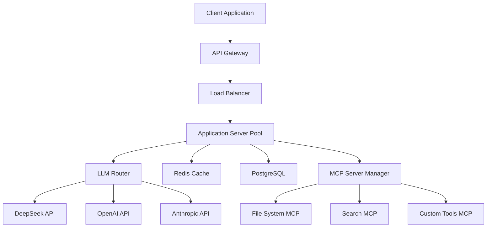
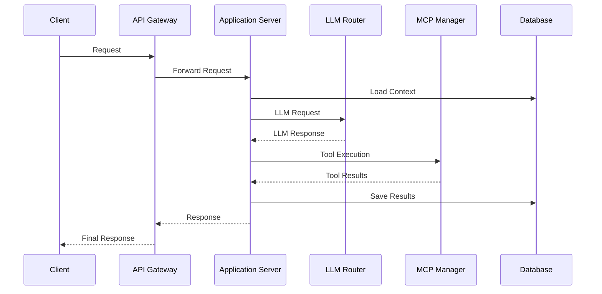
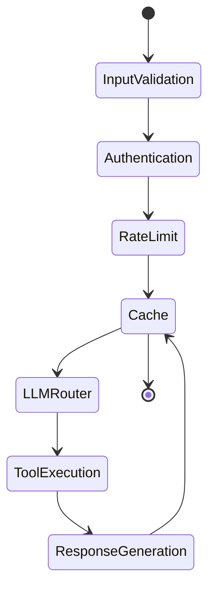
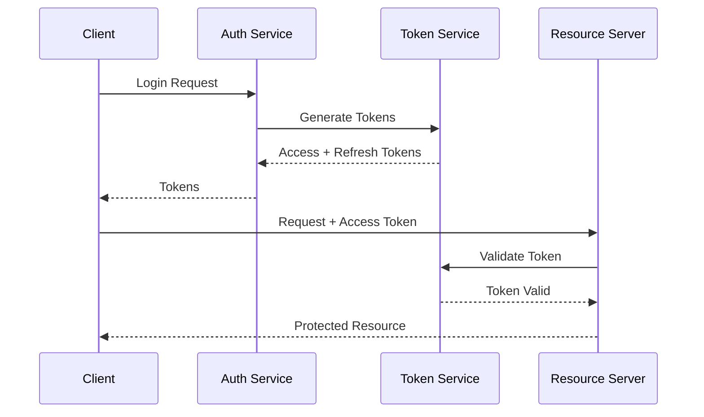

# DeepSeek Engineer Architecture 🏗️

## System Overview

DeepSeek Engineer implements a modular, event-driven architecture that seamlessly integrates multiple Language Model providers and tools through standardized interfaces. This document provides a comprehensive overview of the system architecture, including detailed component interactions, deployment patterns, and scaling considerations.

### High-Level Architecture



### Key Design Principles
1. **Modularity**: All components are loosely coupled and independently deployable
2. **Scalability**: Horizontal scaling through stateless application servers
3. **Reliability**: Automatic failover and retry mechanisms
4. **Observability**: Comprehensive logging and monitoring
5. **Security**: Multi-layer security with principle of least privilege

DeepSeek Engineer is a sophisticated CLI application that leverages the DeepSeek API to create an interactive coding assistant. The system is built with a focus on maintainability, type safety, and extensible design.

## Core Architecture Components

### Component Interactions


### 1. Client Configuration Layer

The client configuration layer manages application settings, API keys, and environment-specific configurations:
```python
client = OpenAI(
    api_key=os.getenv("DEEPSEEK_API_KEY"),
    base_url="https://api.deepseek.com"
)
```
- Handles API authentication and configuration
- Uses environment variables for secure credential management
- Configures base URL for DeepSeek's API endpoint

### 2. Data Models Layer
The application uses Pydantic for robust type checking and data validation:

```python
class FileToCreate(BaseModel):
    path: str
    content: str

class FileToEdit(BaseModel):
    path: str
    original_snippet: str
    new_snippet: str

class AssistantResponse(BaseModel):
    assistant_reply: str
    files_to_create: Optional[List[FileToCreate]] = None
    files_to_edit: Optional[List[FileToEdit]] = None
```

### 3. File Operations Layer
Handles all filesystem interactions:
- File reading (`read_local_file`)
- File creation (`create_file`)
- Diff application (`apply_diff_edit`)
- Path normalization (`normalize_path`)

### 4. Conversation Management Layer
- Maintains conversation history
- Handles system prompts
- Manages message context

### 5. UI/UX Layer
Uses Rich library for enhanced terminal output:
- Colored output
- Tables for diff viewing
- Progress indicators
- Interactive prompts

## Data Flow

### Request Lifecycle


### Data Processing Pipeline
1. **Input Processing**
   ```python
   class RequestProcessor:
       def __init__(self, config: Config):
           self.validator = InputValidator(config)
           self.sanitizer = InputSanitizer()
           
       async def process_request(self, request: Request) -> ProcessedRequest:
           sanitized = await self.sanitizer.clean(request)
           validated = await self.validator.validate(sanitized)
           return ProcessedRequest(validated)
   ```

2. **Context Management**
   ```python
   class ContextManager:
       def __init__(self, redis_client: Redis):
           self.redis = redis_client
           
       async def get_context(self, request_id: str) -> Context:
           context = await self.redis.get(f"context:{request_id}")
           return Context.parse_raw(context) if context else Context()
           
       async def update_context(self, request_id: str, context: Context):
           await self.redis.set(
               f"context:{request_id}",
               context.json(),
               ex=3600  # 1 hour expiry
           )
   ```

1. **Input Processing**
   ```
   User Input -> Command Parser -> Action Handler
   ```

2. **API Communication**
   ```
   Action Handler -> DeepSeek API -> Response Parser -> Output Handler
   ```

3. **File Operations**
   ```
   Output Handler -> File Operation Validator -> File System -> Status Reporter
   ```

## Security Considerations

### Authentication Flow


### Security Implementation
```python
from jose import jwt
from passlib.context import CryptContext

class SecurityService:
    def __init__(self, config: SecurityConfig):
        self.pwd_context = CryptContext(schemes=["bcrypt"])
        self.config = config
        
    def create_access_token(self, data: dict) -> str:
        to_encode = data.copy()
        expire = datetime.utcnow() + timedelta(minutes=15)
        to_encode.update({"exp": expire})
        return jwt.encode(to_encode, self.config.secret_key, "HS256")
        
    def verify_token(self, token: str) -> dict:
        try:
            payload = jwt.decode(token, self.config.secret_key, ["HS256"])
            return payload
        except JWTError:
            raise InvalidTokenError()
            
    def hash_password(self, password: str) -> str:
        return self.pwd_context.hash(password)
        
    def verify_password(self, plain: str, hashed: str) -> bool:
        return self.pwd_context.verify(plain, hashed)
```

### Access Control
```python
from enum import Enum
from typing import List

class Permission(Enum):
    READ = "read"
    WRITE = "write"
    EXECUTE = "execute"
    ADMIN = "admin"

class Role(BaseModel):
    name: str
    permissions: List[Permission]

class AccessControl:
    def __init__(self):
        self.roles: Dict[str, Role] = {}
        
    def check_permission(
        self, 
        user: User, 
        required: Permission
    ) -> bool:
        role = self.roles.get(user.role)
        return required in role.permissions if role else False

1. **API Security**
   - API keys stored in environment variables
   - No hardcoded credentials
   - Secure base URL configuration

2. **File System Security**
   - Path normalization to prevent directory traversal
   - Permission checks before file operations
   - Safe file handling practices

3. **Input Validation**
   - Pydantic models for type safety
   - Input sanitization
   - Error handling for malformed inputs

## Error Handling Strategy

1. **Graceful Degradation**
   - Fallback mechanisms for API failures
   - Clear error messages
   - State recovery procedures

2. **User Feedback**
   - Rich console output for errors
   - Detailed error context
   - Actionable error messages

## Extension Points

1. **New Commands**
   - Add new command handlers in main loop
   - Extend command parsing logic

2. **Additional File Operations**
   - Implement new file operation handlers
   - Add new Pydantic models for operations

3. **Enhanced UI Features**
   - Add new Rich components
   - Extend console output formatting

## Performance Considerations

1. **Memory Management**
   - Conversation history pruning
   - Efficient file handling
   - Stream processing for large responses

2. **API Optimization**
   - Streaming responses
   - Efficient token usage
   - Response caching (future enhancement)

## Future Architecture Considerations

1. **Modularity Improvements**
   - Split into smaller modules
   - Implement plugin system
   - Add middleware support

2. **Scaling Capabilities**
   - Add multi-model support
   - Implement parallel processing
   - Add caching layer

3. **Enhanced Features**
   - Version control integration
   - Project-wide refactoring
   - Code analysis tools integration