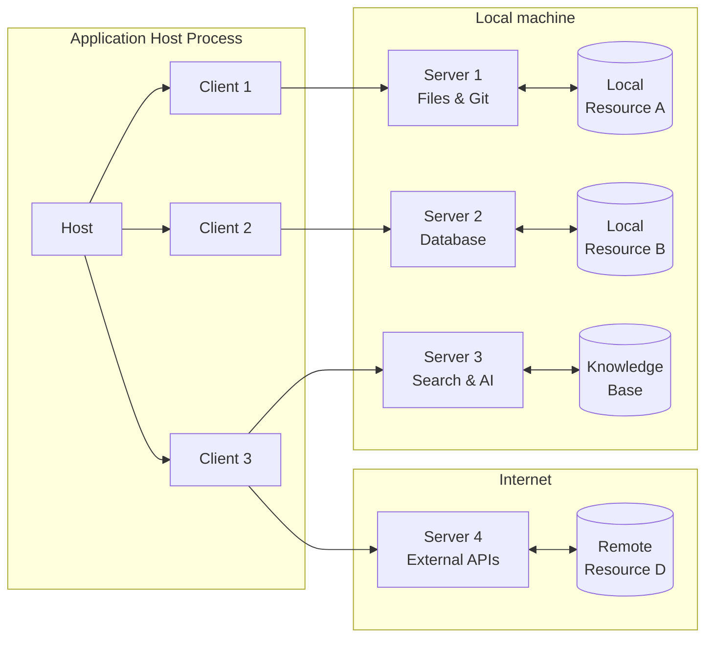

# Model Context Protocol (MCP) Specification 📋

## Overview

The Model Context Protocol (MCP) follows a client-host-server architecture where each host can run multiple client instances. Built on JSON-RPC, MCP provides a stateful session protocol focused on context exchange and sampling coordination between clients and servers.

## Architecture

### Core Components



### Server Categories

1. **System Integration Servers**
   - File System Operations
   - Git Version Control
   - Time Management
   - Process Management

2. **Database Servers**
   - SQLite
   - PostgreSQL
   - Memory Storage

3. **Search & Knowledge Servers**
   - Brave Search
   - AWS KB Retrieval
   - Everything Search

4. **AI/ML Integration Servers**
   - Sequential Thinking
   - EverArt Generation

5. **External API Servers**
   - Google Maps
   - Slack Integration
   - GitHub/GitLab

6. **Monitoring Servers**
   - Sentry Error Tracking
   - Performance Monitoring

### Component Roles

#### Host
- Creates and manages multiple client instances
- Controls client connection permissions and lifecycle
- Enforces security policies and consent requirements
- Handles user authorization decisions
- Coordinates AI/LLM integration and sampling
- Manages context aggregation across clients

#### Clients
- Establishes one stateful session per server
- Handles protocol negotiation and capability exchange
- Routes protocol messages bidirectionally
- Manages subscriptions and notifications
- Maintains security boundaries between servers

#### Servers
- Expose resources, tools and prompts via MCP primitives
- Operate independently with focused responsibilities
- Request sampling through client interfaces
- Must respect security constraints
- Can be local processes or remote services

## Protocol Specification

### 1. Message Types

```typescript
interface MCPRequest {
    jsonrpc: "2.0";
    method: string;
    params: any;
    id: string;
}

interface MCPResponse {
    jsonrpc: "2.0";
    result?: any;
    error?: MCPError;
    id: string;
}

interface MCPError {
    code: number;
    message: string;
    data?: any;
}
```

### 2. Initialization Phase

```typescript
interface InitializeRequest {
    protocolVersion: string;  // e.g. "2024-11-05"
    capabilities: {
        roots?: { listChanged?: boolean };
        sampling?: {};
        experimental?: Record<string, any>;
    };
    clientInfo: {
        name: string;
        version: string;
    };
}

interface InitializeResponse {
    protocolVersion: string;
    capabilities: {
        logging?: {};
        prompts?: { listChanged?: boolean };
        resources?: {
            subscribe?: boolean;
            listChanged?: boolean;
        };
        tools?: { listChanged?: boolean };
        experimental?: Record<string, any>;
    };
    serverInfo: {
        name: string;
        version: string;
    };
}
```

### 3. Resource Management

```typescript
interface Resource {
    uri: string;
    name: string;
    mimeType?: string;
    description?: string;
}

interface ResourceTemplate {
    uriTemplate: string;  // RFC 6570 URI Template
    name: string;
    mimeType?: string;
    description?: string;
}

interface ResourceContent {
    uri: string;
    mimeType: string;
    text: string;
}

interface ResourceProvider {
    getResource(uri: string): Promise<ResourceContent>;
    listResources(): Promise<Resource[]>;
    listTemplates(): Promise<ResourceTemplate[]>;
}
```

### 4. Tool Implementation

```typescript
interface ToolDefinition {
    name: string;
    description: string;
    inputSchema: {
        type: "object";
        properties: Record<string, any>;
        required: string[];
    };
}

interface ToolResult {
    content: Array<{
        type: string;
        text: string;
    }>;
    isError?: boolean;
}

interface ToolExecutor {
    execute(params: any): Promise<ToolResult>;
    validate(params: any): boolean;
    handleError(error: Error): ToolResult;
}
```

## Protocol Lifecycle

### 1. Initialization
- Client sends initialize request with capabilities
- Server responds with supported capabilities
- Version negotiation occurs
- Connection established on success

### 2. Operation
- Normal protocol communication
- Tool and resource requests
- Notifications and updates
- Error handling

### 3. Shutdown
- Graceful termination
- Resource cleanup
- Connection closure

## Error Handling

### Error Codes
```typescript
enum ErrorCode {
    ParseError = -32700,
    InvalidRequest = -32600,
    MethodNotFound = -32601,
    InvalidParams = -32602,
    InternalError = -32603,
    ResourceNotFound = -32001,
    ResourceAccessDenied = -32002,
    ToolExecutionError = -32003,
    RateLimitExceeded = -32004,
    ExternalServiceError = -32005
}
```

### Error Response Format
```typescript
interface ErrorResponse {
    jsonrpc: "2.0";
    error: {
        code: ErrorCode;
        message: string;
        data?: any;
    };
    id: string | null;
}
```

## Security Considerations

### 1. Access Control
```typescript
interface AccessControl {
    checkAccess(resource: string, operation: string): boolean;
    grantAccess(resource: string, operation: string): void;
    revokeAccess(resource: string, operation: string): void;
}
```

### 2. Rate Limiting
```typescript
interface RateLimiter {
    checkLimit(key: string, limit: number, window: number): boolean;
    resetLimit(key: string): void;
    getLimitStatus(key: string): {
        remaining: number;
        reset: number;
    };
}
```

### 3. Security Guidelines
- Implement proper authentication if needed
- Validate all inputs
- Control resource access
- Handle sensitive data appropriately
- Implement rate limiting
- Monitor for abuse

## Best Practices

### 1. Implementation
- Follow protocol specification exactly
- Implement proper error handling
- Validate all inputs
- Handle resource cleanup
- Use TypeScript/Python for type safety

### 2. Performance
- Optimize transport layer
- Handle concurrent requests
- Implement proper timeouts
- Monitor resource usage
- Cache when appropriate

### 3. Maintenance
- Log operations
- Monitor errors
- Track performance
- Update dependencies
- Follow security advisories

## Future Considerations

### 1. Protocol Evolution
- Version management
- Backward compatibility
- Feature extensions
- Performance improvements

### 2. Security Enhancements
- Standardized authentication
- Fine-grained access control
- Audit logging
- Threat protection

### 3. Feature Extensions
- Binary data support
- Streaming capabilities
- Real-time updates
- Enhanced monitoring

## Reference Implementation

The reference implementation of this specification can be found in the DeepSeek Engineer codebase. For practical examples and usage patterns, refer to the [MCP Implementation Guide](mcp-implementation.md) and [MCP Best Practices](mcp-best-practices.md).

## Schema

The full specification is defined in TypeScript, serving as the source of truth for all protocol messages and structures. Implementations should refer to this schema for type definitions and validation.