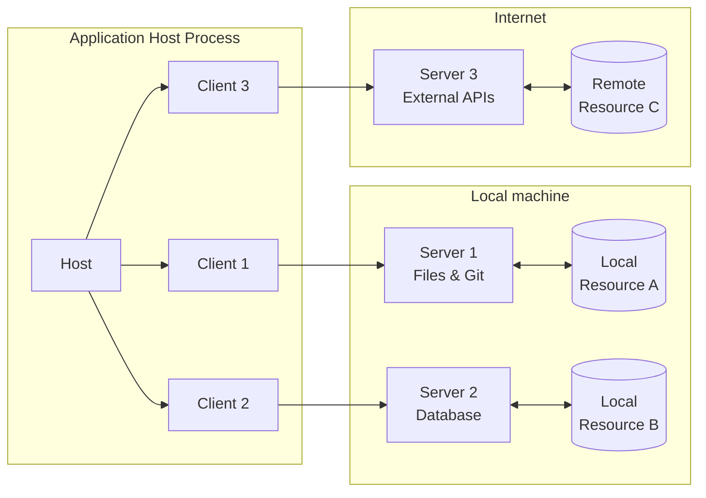
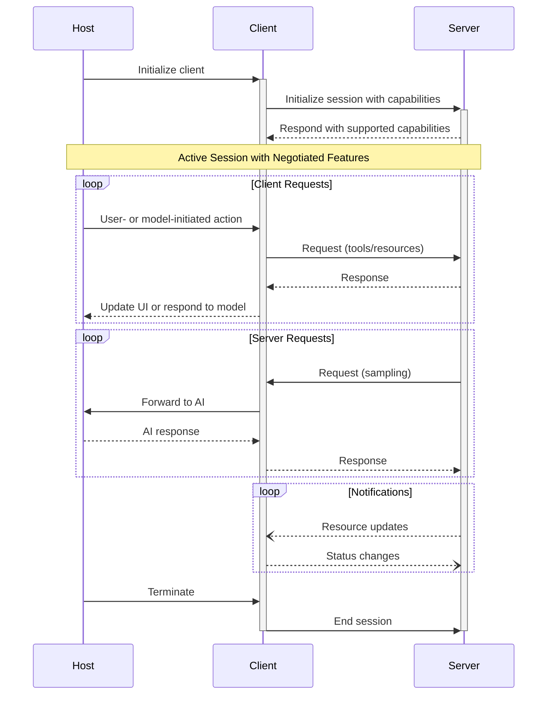

# Model Context Protocol (MCP) Specification

## Overview

The Model Context Protocol (MCP) follows a client-host-server architecture where each host can run multiple client instances. Built on JSON-RPC, MCP provides a stateful session protocol focused on context exchange and sampling coordination between clients and servers.

## Architecture

### Core Components



### Host
The host process acts as the container and coordinator:
- Creates and manages multiple client instances
- Controls client connection permissions and lifecycle
- Enforces security policies and consent requirements
- Handles user authorization decisions
- Coordinates AI/LLM integration and sampling
- Manages context aggregation across clients

### Clients
Each client is created by the host and maintains an isolated server connection:
- Establishes one stateful session per server
- Handles protocol negotiation and capability exchange
- Routes protocol messages bidirectionally
- Manages subscriptions and notifications
- Maintains security boundaries between servers

### Servers
Servers provide specialized context and capabilities:
- Expose resources, tools and prompts via MCP primitives
- Operate independently with focused responsibilities
- Request sampling through client interfaces
- Must respect security constraints
- Can be local processes or remote services

## Design Principles

1. **Servers should be extremely easy to build**
    - Host applications handle complex orchestration responsibilities
    - Servers focus on specific, well-defined capabilities
    - Simple interfaces minimize implementation overhead
    - Clear separation enables maintainable code

2. **Servers should be highly composable**
    - Each server provides focused functionality in isolation
    - Multiple servers can be combined seamlessly
    - Shared protocol enables interoperability
    - Modular design supports extensibility

3. **Servers should not be able to read the whole conversation, nor "see into" other servers**
    - Servers receive only necessary contextual information
    - Full conversation history stays with the host
    - Each server connection maintains isolation
    - Cross-server interactions are controlled by the host
    - Host process enforces security boundaries

4. **Features can be added to servers and clients progressively**
    - Core protocol provides minimal required functionality
    - Additional capabilities can be negotiated as needed
    - Servers and clients evolve independently
    - Protocol designed for future extensibility
    - Backwards compatibility is maintained

## Protocol Lifecycle

The Model Context Protocol defines three distinct phases for client-server connections:

1. **Initialization**: Capability negotiation and protocol version agreement
2. **Operation**: Normal protocol communication
3. **Shutdown**: Graceful termination of the connection

### Initialization Phase

The initialization phase **MUST** be the first interaction between client and server. During this phase:

```typescript
// Client initialize request
interface InitializeRequest {
    protocolVersion: string;  // e.g. "2024-11-05"
    capabilities: {
        roots?: { listChanged?: boolean };
        sampling?: {};
        experimental?: Record<string, any>;
    };
    clientInfo: {
        name: string;
        version: string;
    };
}

// Server initialize response
interface InitializeResponse {
    protocolVersion: string;
    capabilities: {
        logging?: {};
        prompts?: { listChanged?: boolean };
        resources?: {
            subscribe?: boolean;
            listChanged?: boolean;
        };
        tools?: { listChanged?: boolean };
        experimental?: Record<string, any>;
    };
    serverInfo: {
        name: string;
        version: string;
    };
}
```

#### Version Negotiation

- Client **MUST** send its latest supported protocol version in initialize request
- Server **MUST** respond with same version if supported, or another supported version
- Client **SHOULD** disconnect if it doesn't support server's version
- Current protocol version is "2024-11-05"

#### Capability Negotiation

Key capabilities include:

| Category | Capability     | Description |
|----------|---------------|-------------|
| Client   | `roots`        | Filesystem roots access |
| Client   | `sampling`     | LLM sampling support |
| Client   | `experimental` | Non-standard features |
| Server   | `prompts`      | Prompt templates |
| Server   | `resources`    | Readable resources |
| Server   | `tools`        | Callable tools |
| Server   | `logging`      | Structured logging |
| Server   | `experimental` | Non-standard features |

### Operation Phase

During operation, clients and servers **MUST**:
- Respect the negotiated protocol version
- Only use successfully negotiated capabilities
- Handle errors appropriately
- Implement request timeouts

### Shutdown Phase

Shutdown can be initiated by either party:
- Client typically initiates by closing transport
- Server may initiate by closing its output stream
- Implementations should handle timeouts gracefully

## Protocol Structure

### Message Types
All messages between MCP clients and servers **MUST** follow the [JSON-RPC 2.0](https://www.jsonrpc.org/specification) specification:

```typescript
interface MCPRequest {
    jsonrpc: "2.0";
    method: string;
    params: any;
    id: string;
}

interface MCPResponse {
    jsonrpc: "2.0";
    result?: any;
    error?: MCPError;
    id: string;
}

interface MCPError {
    code: number;
    message: string;
    data?: any;
}
```

### Capability Negotiation



## Server Implementation

### Core Components

```typescript
interface MCPServer {
    name: string;
    version: string;
    capabilities: {
        tools: Record<string, Tool>;
        resources: Record<string, Resource>;
    };
}

interface Tool {
    name: string;
    description: string;
    inputSchema: JSONSchema;
}

interface Resource {
    uri: string;
    name: string;
    mimeType?: string;
    description?: string;
}
```

### Resource Management

```typescript
interface ResourceTemplate {
    uriTemplate: string;  // RFC 6570 URI Template
    name: string;
    mimeType?: string;
    description?: string;
}

interface ResourceContent {
    uri: string;
    mimeType: string;
    text: string;
}

interface ResourceProvider {
    getResource(uri: string): Promise<ResourceContent>;
    listResources(): Promise<Resource[]>;
    listTemplates(): Promise<ResourceTemplate[]>;
}
```

### Tool Implementation

```typescript
interface ToolDefinition {
    name: string;
    description: string;
    inputSchema: {
        type: "object";
        properties: Record<string, any>;
        required: string[];
    };
}

interface ToolResult {
    content: Array<{
        type: string;
        text: string;
    }>;
    isError?: boolean;
}

interface ToolExecutor {
    execute(params: any): Promise<ToolResult>;
    validate(params: any): boolean;
    handleError(error: Error): ToolResult;
}
```

## Error Handling

### Error Codes

```typescript
enum ErrorCode {
    ParseError = -32700,
    InvalidRequest = -32600,
    MethodNotFound = -32601,
    InvalidParams = -32602,
    InternalError = -32603,
    ResourceNotFound = -32001,
    ResourceAccessDenied = -32002,
    ToolExecutionError = -32003
}
```

## Security Considerations

Authentication and authorization are not currently part of the core MCP specification, but are being considered for future versions. Clients and servers **MAY** negotiate their own custom authentication and authorization strategies.

### Resource Access Control

```typescript
interface AccessControl {
    checkAccess(resource: string, operation: string): boolean;
    grantAccess(resource: string, operation: string): void;
    revokeAccess(resource: string, operation: string): void;
}
```

## Schema

The full specification of the protocol is defined as a [TypeScript schema](http://github.com/modelcontextprotocol/specification/tree/main/schema/schema.ts). This is the source of truth for all protocol messages and structures.

There is also a [JSON Schema](http://github.com/modelcontextprotocol/specification/tree/main/schema/schema.json), which is automatically generated from the TypeScript source of truth, for use with various automated tooling.

## Best Practices

1. **Implementation**
   - Follow protocol specification exactly
   - Implement proper error handling
   - Validate all inputs
   - Handle resource cleanup

2. **Security**
   - Implement custom authentication if needed
   - Validate requests
   - Control resource access
   - Handle sensitive data

3. **Performance**
   - Optimize transport
   - Handle concurrent requests
   - Implement timeouts
   - Monitor resource usage

## Future Considerations

1. **Protocol Evolution**
   - Version management
   - Backward compatibility
   - Feature extensions
   - Performance improvements

2. **Security Enhancements**
   - Standardized authentication mechanisms
   - Fine-grained access control
   - Audit logging
   - Threat protection